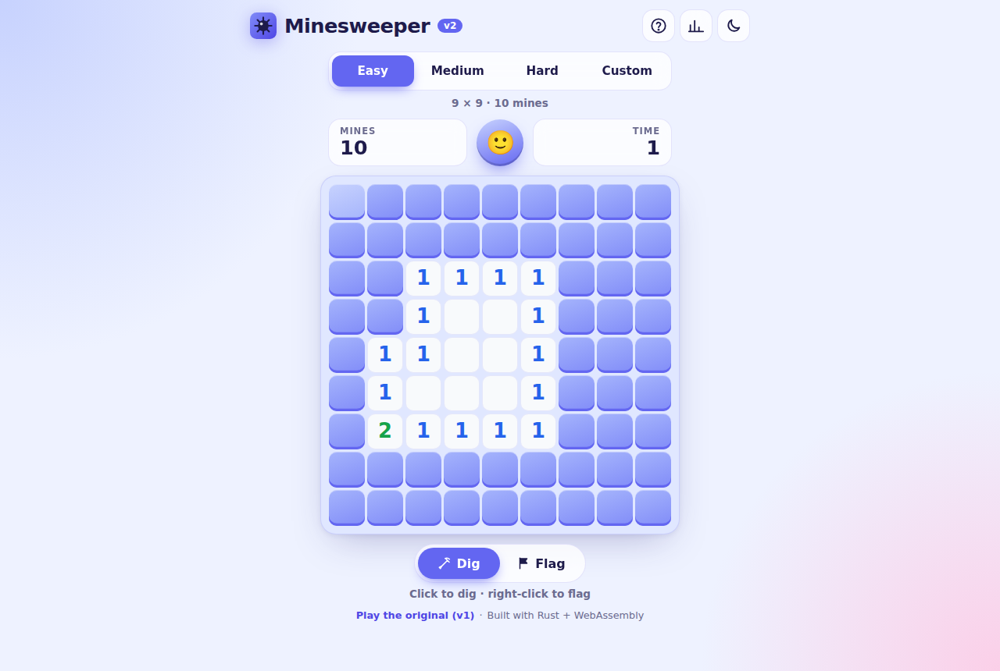
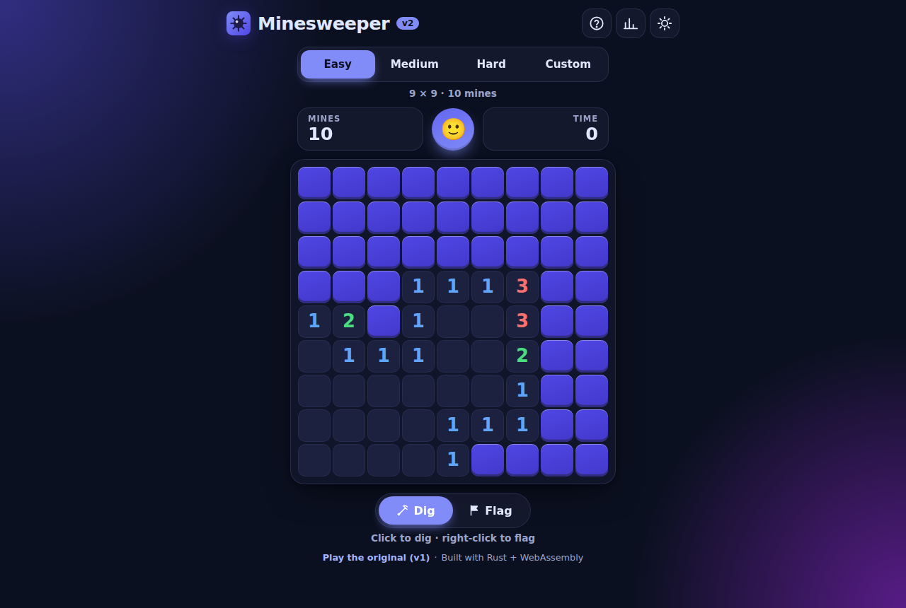
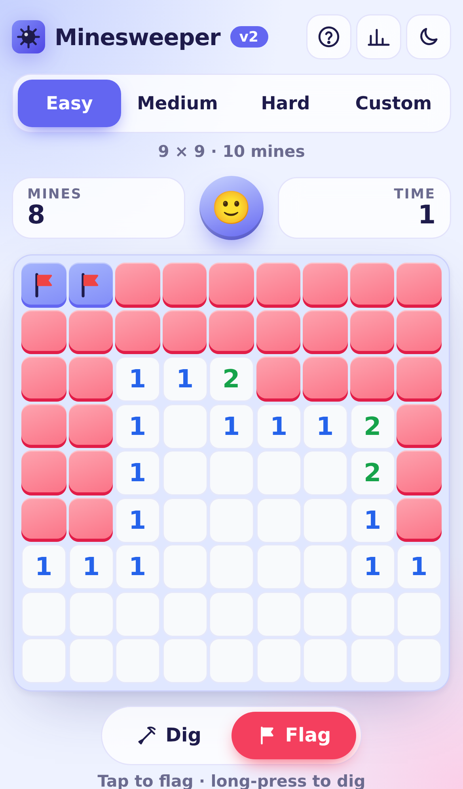
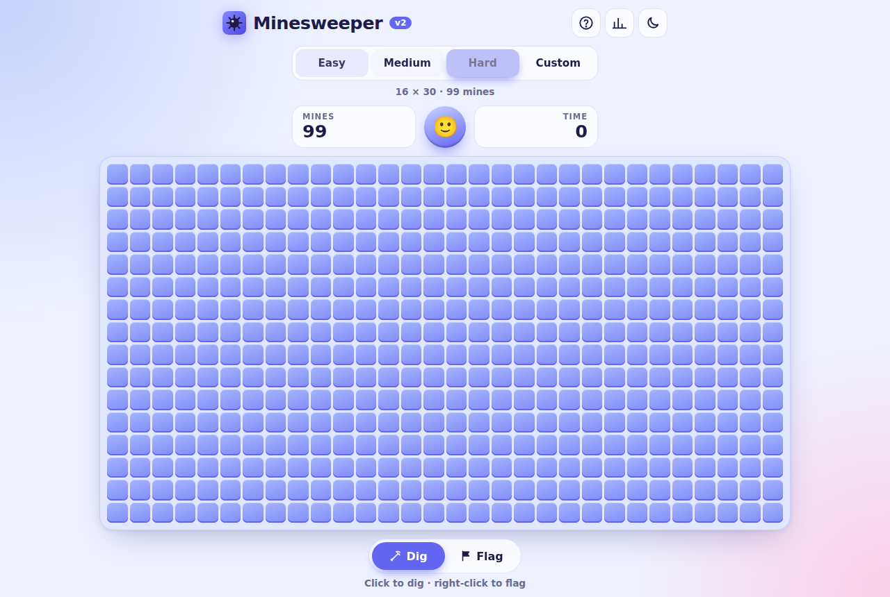
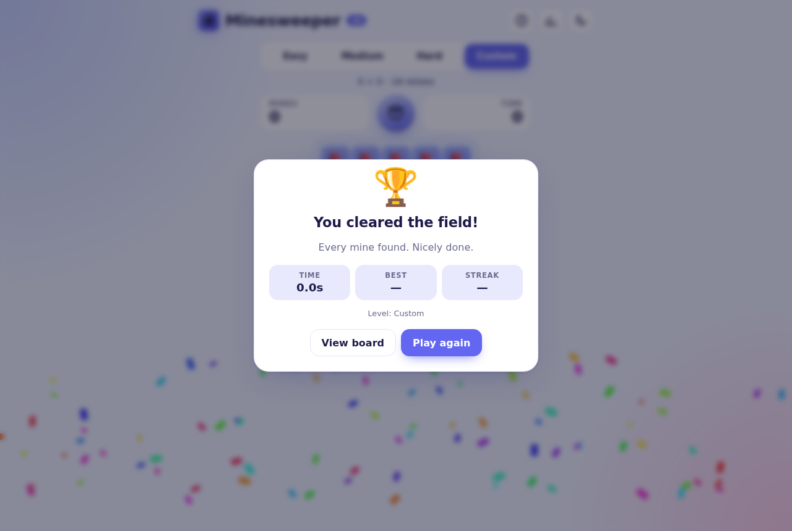

# Minesweeper v2: Feature Document

**Author:** Savio Bajpai
**Status:** Final Draft
**Previous version:** v1, Vanilla JavaScript (2017). See `featureDocument/featureDocumeFinalDraft.odt`.
**Live paths:** `/v2/` (this version) · `/v1/` (the original, unchanged)

---

## 1. Overview

v1 was built in 2017 to learn JavaScript. v2 is a rewrite in a different language that keeps the same game and fixes what v1 could not do. It also adds the "Future Enhancements" listed at the end of the v1 document. The goals:

1. **A new language.** The game is written in **Rust** and compiled to **WebAssembly**.
2. **Free hosting on Vercel.** v2 builds to plain static files, so it runs on Vercel's free Hobby plan with no server.
3. **An attractive, easy-to-use interface.** It has a modern look with light and dark themes, animations and clear feedback.
4. **Works on any device.** Phones, tablets and desktops, with touch, mouse and keyboard all supported.

### 1.1 Why Rust + WebAssembly?

| Need | How Rust + WASM meets it |
|---|---|
| Learn a new language | Rust teaches ownership, enums, pattern matching and strong typing, which is a real step up from v1's loosely typed JS. |
| Deploy free on Vercel | `cargo` + `wasm-bindgen` produce a `.wasm` file and a small JS loader. Vercel serves them as static files at no cost. |
| Runs on every device | WebAssembly is supported by all current browsers (Chrome, Safari incl. iOS, Firefox, Edge, Samsung Internet). |
| Fast and small | The whole game is about 176 KB of WASM, loads instantly and never waits on a network round-trip. |
| Testable logic | The engine has no browser code, so it is unit-tested natively with `cargo test`. |

Alternatives considered:

- **Python on Vercel serverless functions:** every click would need a server round-trip, the game state would need storing somewhere, and cold starts are slow. Rejected.
- **Go → WASM:** works, but Go's runtime makes the WASM file about 2 MB and the browser interop is clunkier. Rejected.
- **TypeScript:** it is still JavaScript, so it doesn't meet the "new language" goal. Rejected.

---

## 2. Predefined Rules

The rules are the same as v1 (see the v1 document). The changes are marked **(new)**.

- The objective is to open every cell that does not contain a mine, in the minimum time.
- When the user digs a cell:
  - It may be **blank** (no mines around it). All connected blank cells and their numbered borders open automatically.
  - It may show a **number N** (1–8), meaning exactly N of the 8 surrounding cells (including diagonals) contain mines.
  - It may contain a **mine**, and the game is lost.
- **(new) The first dig is always safe.** Mines are placed *after* the first dig, away from that cell and its neighbours, so the first dig always opens an area. If the board is too dense for that, only the dug cell itself is guaranteed safe.
- The user can place **flags** on cells they believe hide mines. A flagged cell cannot be dug until the flag is removed.
- Flags are markers only. The game can be won without placing them, and a wrongly placed flag is revealed with a cross when the game is lost.
- **(new) Flags are respected by the flood fill.** An automatic opening never removes a flag. (v1 silently removed them.)
- **(new) Chording:** digging an already-open number whose surrounding flag count equals the number opens all its remaining neighbours at once. If a flag was wrong, a mine is hit.
- Once a cell is open, it cannot be flagged.
- **(changed) No time-out.** v1 ended the game at 10 minutes. v2 lets you play on, and the display stops counting at 999 seconds as in classic Minesweeper.

---

## 3. Interface

### 3.1 Desktop





### 3.2 Phone (Flag mode switched on)



### 3.3 Hard level and end-of-game dialog





### 3.4 Layout

```
┌──────────────────────────────────────────────┐
│ [logo] Minesweeper v2         [?] [📊] [◐]   │  Top bar: help, statistics, theme
├──────────────────────────────────────────────┤
│   [ Easy | Medium | Hard | Custom ]          │  Difficulty (segmented control)
│            9 × 9 · 10 mines                  │  Level details
├──────────────────────────────────────────────┤
│ ┌─────────┐      ( 🙂 )       ┌─────────┐    │  HUD: mines left · new game face · timer
│ │ MINES 10│                   │ TIME  0 │    │
│ └─────────┘                   └─────────┘    │
├──────────────────────────────────────────────┤
│ ┌──────────────────────────────────────────┐ │
│ │                 Board                    │ │  Scrolls inside its card if needed
│ └──────────────────────────────────────────┘ │
├──────────────────────────────────────────────┤
│           [ ⛏ Dig | 🚩 Flag ]                │  Tap-mode switch (touch friendly)
│     Tap to dig · long-press to flag          │  Context-aware hint
│   Play the original (v1) · Rust + WASM       │  Footer
└──────────────────────────────────────────────┘
Dialogs: Result · How to play · Statistics · Custom board
(on phones they slide up from the bottom)
```

### 3.5 Controls

| Action | Touch | Mouse | Keyboard |
|---|---|---|---|
| Dig | Tap | Left click | <kbd>Enter</kbd> / <kbd>Space</kbd> |
| Flag / unflag | Long-press (380 ms), or tap in Flag mode | Right click | <kbd>F</kbd> |
| Chord | Tap an open number | Click an open number | <kbd>Enter</kbd> on a number |
| Move | n/a | n/a | Arrow keys |
| Switch Dig/Flag mode | Mode switch | Mode switch | <kbd>M</kbd> |
| New game | Face button | Face button | <kbd>N</kbd> |
| Help | <kbd>?</kbd> button | <kbd>?</kbd> button | <kbd>?</kbd> |

The face shows the game state: 🙂 playing, 😮 pressing a cell, 😎 won, 😵 lost.

---

## 4. Implementation

### 4.1 Technology stack

| Layer | Technology |
|---|---|
| Game engine | Rust (`v2/src/engine.rs`), no dependencies |
| UI / behaviour | Rust with `web-sys` DOM bindings (`v2/src/ui.rs`) |
| Persistence | `localStorage` via Rust (`v2/src/storage.rs`) |
| JS ↔ WASM glue | `wasm-bindgen` (generated, `pkg/minesweeper_v2.js`) |
| Markup / styling | HTML5 + CSS (custom properties, grid, `clamp()`, `dvh`) |
| Bootstrap | 10-line `main.js` that loads the WASM module |
| Hosting | Vercel (static output, free Hobby plan) |

### 4.2 Folder structure

```
minesweeper/
├── v1/                     Original 2017 game, unchanged (served at /v1/)
├── v2/
│   ├── Cargo.toml          Rust crate manifest
│   ├── Cargo.lock
│   ├── src/
│   │   ├── lib.rs          WASM entry point (#[wasm_bindgen(start)])
│   │   ├── engine.rs       Pure game logic + unit tests
│   │   ├── storage.rs      localStorage + statistics + unit tests
│   │   └── ui.rs           DOM rendering and input handling
│   └── web/
│       ├── index.html      Page shell and dialogs
│       ├── style.css       Themes, layout, animations
│       ├── main.js         Loads the WASM module
│       ├── manifest.webmanifest   Installable web-app metadata
│       └── icons/          SVG + PNG app icons
├── scripts/build.sh        Builds dist/ (used by Vercel)
├── vercel.json             Build command, output dir, routes
└── featureDocument/        v1 drafts + this document (v2/)
```

### 4.3 Assumptions

- The browser supports WebAssembly and ES modules (every current browser does). Otherwise a friendly message is shown.
- Statistics are stored only in the browser (`localStorage`). There are no accounts and no server.
- If storage is blocked (e.g. private mode), the game still works and simply doesn't remember settings.
- Custom boards are 5–30 rows × 5–30 columns, with 1 to (rows × cols − 9) mines, so the first-dig opening always fits.

### 4.4 Conventions

- Rust code follows `rustfmt` and passes `cargo clippy` with no warnings.
- Cells are addressed by a single **index** `i = row × cols + col`. `row_col(i)` and `index(row, col)` convert between the two.
- The engine never touches the DOM. The UI never changes game state directly; it only calls engine methods.

### 4.5 Data structures

v1 stored state as extra properties on DOM `<button>` elements (`button.hasValue`, `button.isFlag`, …). v2 separates **model** from **view**.

**Cell** (struct)

| Field | Type | Meaning |
|---|---|---|
| `mine` | `bool` | Cell holds a mine (v1: `hasValue == -1`) |
| `adjacent` | `u8` | Mines in the 8 neighbours, 0–8 (v1: `hasValue` 0–2+) |
| `mark` | `Mark` | `Hidden`, `Flagged` or `Revealed` (v1: `isFlag` + `isVisible`) |

Merging v1's two booleans into one `Mark` enum makes impossible states (flagged *and* visible) impossible to represent.

**Status** (enum): `Ready` (mines not yet placed) → `Playing` → `Won` | `Lost`.

**Config** (struct): `rows`, `cols`, `mines`.

**Board** (struct): replaces v1's global `gGame` object.

| Field | Type | v1 equivalent |
|---|---|---|
| `config` | `Config` | `iMaxGridCoordinateX/Y`, `iMinesCount` |
| `cells` | `Vec<Cell>` (flat, row-major) | `lstGrid` (array of arrays of buttons) |
| `status` | `Status` | `gameOn` |
| `flags` | `usize` | `iFlagsCount` |
| `revealed` | `usize` | `unopenedCells()` (recounted on every click in v1) |
| `exploded` | `Option<usize>` | n/a |
| `rng` | `Rng` (xorshift64*) | `Math.random()` |

Keeping `revealed` as a running counter turns v1's O(n) win check on every click into O(1).

**App** (UI state, `ui.rs`): the `Board`, current `Level`, cached `View` per cell (so only changed cells are re-drawn), focused cell, flag mode, timer handles, long-press state and a `game_id` used to cancel stale timeouts.

**Stats** (per level, `storage.rs`): `played`, `won`, `streak`, `best_streak`, `best_ms`.

### 4.6 Main functions (engine)

- **`Board::new(config, seed)`** creates an all-hidden board. Mines are *not* placed yet (v1's `createGrid` + `plantMines` ran up front).
- **`place_mines(safe)`** runs on the first dig.
  1. Build an exclusion zone: the dug cell plus its neighbours (or just the cell if the board is too dense).
  2. Collect all other cells as candidates.
  3. Run a partial **Fisher–Yates shuffle**: the first `mines` candidates become mines. This gives unique random positions without v1's repeated `splice`.
  4. Compute `adjacent` for every cell (v1: `setNumbersAroundMines`).
- **`reveal(i)`** digs one cell.
  - It ignores the call if the game is over or the cell isn't `Hidden`.
  - On the first call it places mines and sets status to `Playing`.
  - On a mine it sets `Lost` and records `exploded`.
  - Otherwise it does a **breadth-first flood fill** with a queue: it opens the cell, and if `adjacent == 0` it queues hidden, unflagged neighbours. (v1 used a stack-based fill in `revealCells`.)
  - It returns the opened cells in BFS order, which the UI uses to ripple the animation outward.
  - When `revealed == cells − mines`, it calls `win()`.
- **`chord(i)`** opens all hidden neighbours of an open number when the flag count matches.
- **`dig(i)`** dispatches to `reveal` or `chord` depending on the cell.
- **`toggle_flag(i)`** switches between `Hidden` and `Flagged` and keeps the `flags` counter in sync (v1: `showFlag` / `hideFlag`).
- **`win()`** sets `Won` and auto-flags every mine so the board reads as solved.

### 4.7 Event handling (UI)

All handlers use **event delegation**: one listener on the board instead of two per cell as in v1 (480 cells × 2 on Hard).

- **`click`** → `primary(i)`: dig, or flag when Flag mode is on.
- **`contextmenu`** → `secondary(i)`: flag, or dig in Flag mode. It also catches Android's own long-press menu.
- **`pointerdown` / `pointermove` / `pointerup` / `pointercancel`** detect a **long-press** for touch and pen input. They cancel it if the finger moves more than 12 px (so scrolling never flags), and suppress the click that follows a long-press so it doesn't also dig.
- **`keydown` on the board** handles arrow keys (roving `tabindex`) and <kbd>F</kbd>.
- **`keydown` on the document** handles <kbd>N</kbd>, <kbd>M</kbd> and <kbd>?</kbd> (ignored while typing or when a dialog is open).
- **`resize`** flips Hard between 16×30 and 30×16 when the orientation changes, but only before the first move.

### 4.8 Utility functions

| Function | Purpose |
|---|---|
| `neighbors(i)` | Valid surrounding indices (replaces v1's `isValidCell` + pattern list) |
| `Config::custom(r, c, m)` | Validates custom boards with a readable error message |
| `Rng::below(n)` | Random integer in `0..n` (v1: `getRandomNum`) |
| `paint(origin, step)` | Re-draws only changed cells, with a ripple delay by distance |
| `update_hud()` | Mines-left counter and timer (v1: `setText`) |
| `start_timer` / `stop_timer` | Precise timing with `performance.now()`. The display ticks every 250 ms. |
| `finish(won)` | Records statistics and fills and opens the result dialog |
| `confetti()` | Win celebration (skipped when the OS asks for reduced motion) |
| `Stats::record` / `format_ms` | Best time, streaks, `12.3s` / `1:02.5` formatting |

---

## 5. Additional details

### 5.1 Winning condition

`revealed == rows × cols − mines`. All safe cells are open; flags are not required.

### 5.2 Losing condition

Digging a cell that contains a mine, directly or through a chord with a wrong flag. The exploded mine is highlighted, all other mines are shown in a ripple, and wrong flags are crossed out.

### 5.3 Difficulty levels

| Level | Board | Mines | Density |
|---|---|---|---|
| Easy | 9 × 9 | 10 | 12% |
| Medium | 16 × 16 | 40 | 16% |
| Hard | 16 × 30 (30 × 16 in portrait) | 99 | 21% |
| Custom | 5–30 × 5–30 | 1 to cells − 9 | any |

These are the standard Windows Minesweeper sizes. v1 used 7×7, 9×9 and 11×11, with 2, 4 or 6 mines per 25 cells.

### 5.4 Responsive design (any device)

- **Cell size is computed in CSS:** `clamp(min, fit-to-width/height, 46px)`. The board always uses the space available.
- **Phones (≤ 520 px):** the board fits the screen width, so there is never sideways scrolling. Tall boards scroll vertically, and dialogs become bottom sheets.
- **Hard in portrait** is turned 90° (30 rows × 16 columns). The game is identical, but it fits a phone.
- **Touch-friendly:** large buttons (≥ 40 px), long-press to flag, a Dig/Flag switch for one-handed play, no double-tap zoom, no text-selection or callout popups on long-press, and haptic feedback (vibration) where supported.
- **Safe areas:** respects iPhone notches and home bars (`env(safe-area-inset-*)`).
- **Installable:** a web app manifest and icons let it be added to the home screen and run full-screen.

Tested on (Playwright device emulation): iPhone SE, iPhone 13, Pixel 7, Galaxy S9+, iPad Pro 11 (landscape), and a 1280 × 860 desktop.

### 5.5 Themes

Light and dark themes are both built from CSS custom properties. The game follows the OS setting by default, the toggle remembers the user's choice, and the saved theme is applied before first paint so there is no flash.

### 5.6 Accessibility

- The board is an ARIA `grid` with `row` / `gridcell` roles. Every cell has a label such as "3 mines nearby, row 4, column 7".
- Full keyboard play, with visible focus rings.
- Game events (new game, win, loss, mode change) are announced through a polite live region.
- `prefers-reduced-motion` turns off animations and confetti.
- Number colours are tuned for contrast in both themes.

### 5.7 Statistics

For Easy, Medium and Hard, the game records games played, win %, best time and longest winning streak, all in `localStorage`. The result dialog shows the time, the best time, the current streak and a "New best time!" badge. Statistics can be reset from the Statistics dialog.

### 5.8 Deployment (Vercel, free)

- `vercel.json` sets the build command to `bash scripts/build.sh` and the output directory to `dist`.
- `scripts/build.sh`:
  1. Installs Rust with `rustup` if it is missing. Vercel's build image doesn't include it.
  2. Adds the `wasm32-unknown-unknown` target.
  3. Downloads the pinned `wasm-bindgen` CLI binary, matching the version pinned in `Cargo.toml`.
  4. Runs `cargo build --release --target wasm32-unknown-unknown --locked`.
  5. Copies `v1/` and `v2/web/` into `dist/`, and generates `dist/v2/pkg/`.
- Routes: `/` → redirect to `/v2/`, and `/v1/` → `v1/base.html` (v1 files unchanged).
- Every push to `master` deploys to production. Every other branch gets a preview URL.

### 5.9 Testing

- **Unit tests** (`cargo test`, 12 tests) cover:
  - first-dig safety and the guaranteed opening
  - maximum mine density
  - adjacency counts
  - edge and corner neighbours
  - losing, and winning with auto-flagging
  - flags blocking digs and the flood fill
  - chording
  - custom validation
  - seeded determinism
  - statistics and time formatting
- **End-to-end tests** (Playwright, run during development) cover:
  - digging, flagging and unflagging, and the timer
  - keyboard navigation and the level sizes
  - custom validation, a forced win and a forced loss
  - theme persistence and the statistics and help dialogs
  - on phones: tap to dig, long-press to flag, Flag mode, and the portrait Hard layout with no horizontal scroll
  - zero console errors throughout

---

## 6. v1 → v2 comparison

| Area | v1 (2017) | v2 |
|---|---|---|
| Language | JavaScript (ES5, IIFE) | Rust → WebAssembly |
| State | Properties on DOM buttons | Typed `Board` / `Cell` structs, separate from the view |
| First click | Could hit a mine | Always safe and opens an area |
| Numbers | Recomputed each game, colours for 1 and 2+ | 1–8 with distinct colours |
| Flood fill | Removed user flags | Respects flags |
| Win check | Recounted all cells every click | O(1) counter |
| Input | Mouse only | Mouse, touch (long-press, Flag mode) and keyboard |
| Layout | Fixed 50 px buttons, desktop only | Fluid, phones to large monitors |
| Levels | 7×7, 9×9, 11×11 | 9×9, 16×16, 16×30, Custom |
| Timer | `m:s`, game over at 10 min | Precise `performance.now()`, no time-out |
| Extras | none | Chording, themes, statistics, best times, help, confetti, installable app, accessibility |
| Tests | none | 12 unit tests + E2E suite |
| Hosting | none | Vercel (free) at `/v2/` |

### 6.1 v1's "Future Enhancements": status in v2

| v1 Future Enhancement | v2 |
|---|---|
| Add more difficulty levels | ✅ Easy / Medium / Hard / Custom |
| Increase numbers around mines as level increases | ✅ True counts 1–8 on every level |
| Add numbers 3 and 4 around mines | ✅ All numbers 1–8 |
| Let the user decide the grid size and number of mines | ✅ Custom board dialog with validation |
| Add help on game rules and controls | ✅ "How to play" dialog (<kbd>?</kbd>) |

---

## 7. Estimated time (tasks)

As in v1, development is split into tasks of about 4 hours each.

- **Task 1:** Project setup: Cargo crate, WASM target, `wasm-bindgen`, build script, folder structure.
- **Task 2:** Engine data structures (`Cell`, `Mark`, `Status`, `Config`, `Board`), `neighbors`, `Rng`.
- **Task 3:** `place_mines` (safe first dig, Fisher–Yates), adjacency counts, unit tests.
- **Task 4:** `reveal` (BFS flood fill), `toggle_flag`, `chord`, win and lose logic, unit tests.
- **Task 5:** HTML shell and the CSS design system: themes, board grid, cells, HUD.
- **Task 6:** UI in Rust: building the board, painting cells, timer, HUD, face.
- **Task 7:** Input: mouse, right click, touch long-press, Flag mode, keyboard navigation.
- **Task 8:** Dialogs: result, help, statistics, custom board, plus `localStorage` persistence.
- **Task 9:** Responsive pass for phones and tablets, bottom sheets, portrait Hard, safe areas.
- **Task 10:** Accessibility, reduced motion, icons, manifest.
- **Task 11:** Vercel configuration, end-to-end testing on device emulators, final check.

---

## 8. Future enhancements

- **No-guess mode:** generate boards that can always be solved by logic alone.
- **Daily challenge:** the same seeded board for everyone each day (the engine already supports seeds).
- **Online leaderboard** using a free serverless database (e.g. Vercel KV / Postgres).
- **Offline play** through a service worker.
- **Pinch-to-zoom and pan** for Custom 30 × 30 boards on small phones.
- **Undo the last move** in a relaxed practice mode.
- **Hint button** that highlights a cell provably safe by logic.
